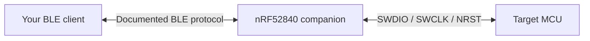

# nRF52840 BLE SWD Companion

[](https://github.com/bve/gnw-ble-swd/actions/workflows/ci.yml)
[](LICENSE)

Firmware for an **nRF52840 SuperMini** that turns BLE commands into SWD
transactions. Developed as a wireless companion for Nintendo Game & Watch,
the bridge exposes target memory, core registers, and execution control over
a documented BLE protocol.

This repository contains **only the nRF companion firmware** and the board files,
build scripts, tests, and documentation needed to develop it. It has no retro-go
or GnWManager build dependency and contains no console firmware, games, or host
application. A compatible BLE client is required to control the bridge; use the
[protocol reference](docs/protocol.md) to integrate your own tools.



## Features

- SWD memory and core register access, halt, resume, reset, and reset-and-halt.
- CRC-protected 16 KiB blocks, a four-request window, and batched memory writes.
- SWCLK ceiling from 100 kHz to 32 MHz, with SPIM3 EasyDMA for the fast data phase.
- Requested BLE 2M PHY, MTU 247, data length extension, and a 15 ms interval.
- Link and power diagnostics, plus idle power management that keeps BLE available.
- BLE command to enter the existing Adafruit Legacy DFU bootloader.
- Application-only DFU ZIP generation for USB installation and later BLE updates.

Hardware validation has used a **Game & Watch Zelda, STM32H7B0, and 64 MiB
MX25U51245 external flash**. The SWD memory engine is separate from the BLE
transport, but arbitrary ARM targets have not been validated. Target-specific
flash algorithms run in the host/target tooling; this firmware supplies SWD
access. It is not a CMSIS-DAP BLE implementation or a GDB server.

## Wiring

Read [hardware and bootloader setup](docs/hardware.md) before connecting boards.
Game & Watch uses approximately **1.8 V logic**. A normal 3.3 V SuperMini needs
level translation for SWDIO and SWCLK. Direct wiring requires a verified,
compatible nRF VDD, including with USB attached.

| Nordic GPIO | Bridge signal |
| --- | --- |
| P0.06 | SWDIO |
| P0.08 | SWCLK |
| P0.20 | Target NRST, open-drain |
| P0.17 | Optional SWDIO level translator direction |
| GND | Common ground |

These are Nordic GPIO numbers, not clone-specific `D0`/`D1` labels. The firmware
expects a compatible Adafruit/nice!nano bootloader with **S140 6.1.1** and
Legacy BLE DFU. The application starts at `0x26000`; neither bootloader nor
SoftDevice images are included in the application package.

## Build and install

Use PlatformIO Core, either installed already or through the development
requirements. The following commands use Python 3.10+ and a POSIX shell:

```bash
git clone https://github.com/bve/gnw-ble-swd.git
cd gnw-ble-swd
python3 -m venv .venv
.venv/bin/python -m pip install -r requirements-dev.txt
.venv/bin/pio run -e supermini
```

On Windows, use `.venv\Scripts\python.exe` and `.venv\Scripts\pio.exe`.
In the PlatformIO IDE, open this directory and choose the `supermini` environment.
The platform and framework versions are pinned in [platformio.ini](platformio.ini).

After checking bootloader compatibility, install the application through USB:

```bash
.venv/bin/pio run -e supermini -t upload --upload-port /dev/ttyACM0
```

Replace the serial port for your system. Without `-t upload`, PlatformIO only
builds. The running application advertises as **`GW-SWD`**.

Build outputs are in `.pio/build/supermini/`:

| File | Purpose |
| --- | --- |
| `firmware.elf` | Linked application with debug symbols |
| `firmware.hex` | Application image at its linked flash address |
| `bridge-dfu.zip` | Legacy DFU application package for nRF52840 / S140 6.1.1 |

The DFU archive contains the raw application `.bin`, its init packet, and the
package manifest. The build does not emit a separate `firmware.bin` file.

## BLE integration and updates

The service UUID is `67777a10-80f1-4e94-9b4a-1c3059860001`.
Write requests to the RX characteristic ending in `0002` and subscribe to
responses on the TX characteristic ending in `0003`. See
[the protocol reference](docs/protocol.md) for framing, commands, status codes,
and a complete INFO request example.

A compatible client can send the `DFU` command to release SWD/NRST and restart
the nRF into its existing bootloader. Then transfer `bridge-dfu.zip` with an
Adafruit-compatible **Nordic Legacy DFU** client, using Packet Receipt Notification
**8 or lower**. Nordic nRF DFU on a phone is one option. The bootloader may
advertise as `AdaDFU` and use a different address from the application.

This repository does not include a host uploader. The package updates only the
application; it does not install the bootloader or SoftDevice. Secure DFU and
MCUboot use different formats. Single-bank DFU has no automatic rollback and
can require USB recovery after an interrupted update. Test a complete update
and return to `GW-SWD` before enclosing the hardware.

## Development

Native tests require Python and `g++`; they do not need PlatformIO or BLE hardware:

```bash
python3 -m unittest discover -s tests/native -v
```

Tests exercise the production SWD and memory code with simulated peripherals,
including clock edges, parity, posted reads, address boundaries, error handling,
and idle timing. CI runs these tests and builds the firmware and DFU archive.
See [architecture](docs/architecture.md) and [CONTRIBUTING.md](CONTRIBUTING.md).

## Limitations and license

The BLE service is currently **open, without pairing or authorization**. A nearby
client can control SWD or request DFU. Use it in a trusted radio environment.
The firmware does not automatically unlock protected targets.

Project-owned source and documentation are licensed under **GNU GPL version 3**
(`GPL-3.0-only`); see [LICENSE](LICENSE). The complete companion application source
is provided here. **Nordic SoftDevice remains a precompiled vendor radio stack**,
not open-source code supplied by this project. Other dependencies retain their
own licenses; see [THIRD_PARTY_NOTICES.md](THIRD_PARTY_NOTICES.md).

Game & Watch is a Nintendo trademark. This is an independent community project.
