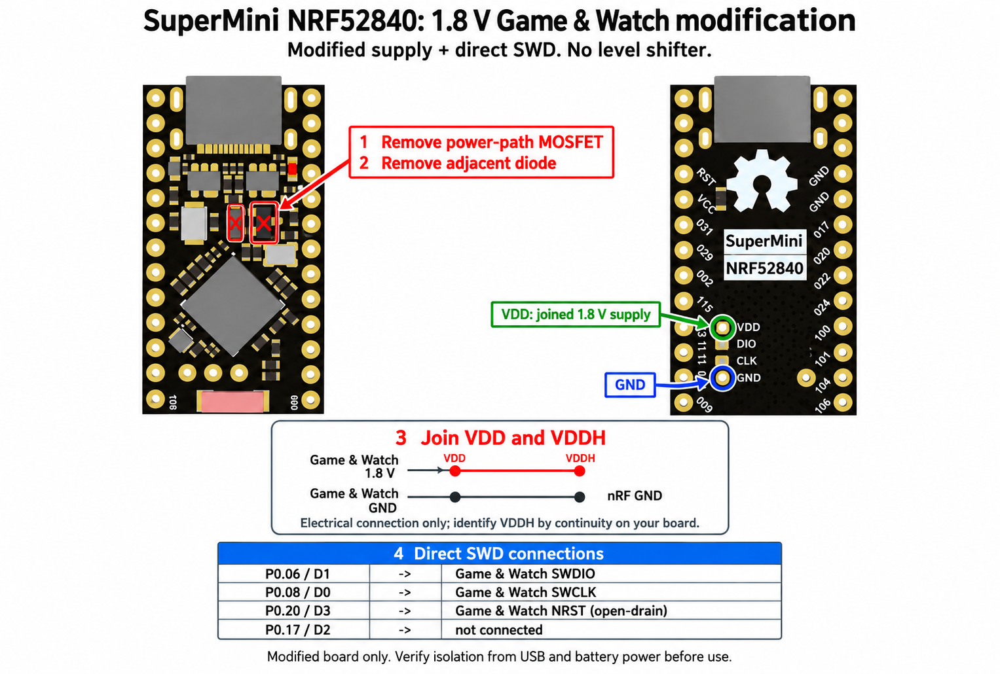
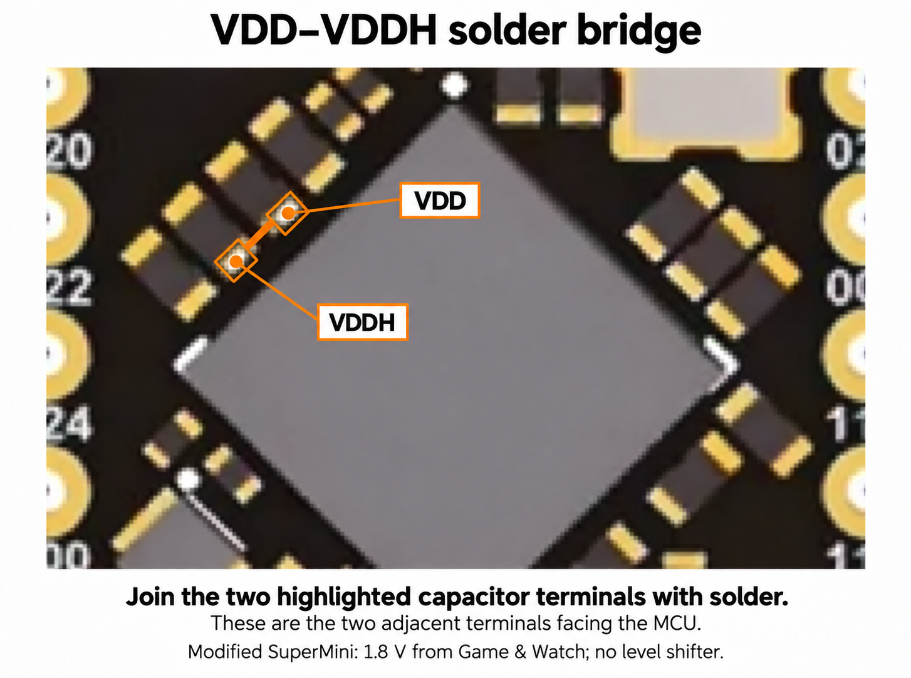

# Wiring and bootloader setup

## Target and GPIO numbering

The validated target is a Game & Watch Zelda with STM32H7B0 and MX25U51245
64 MiB flash. Flash access goes through the STM32 and GnWManager's RAM helper;
the companion does not need wires to the console's external flash chip.

GPIO names below are Nordic port/pin numbers. Check the pinout of your exact
SuperMini revision. Its own SWD programming pads are inputs for programming the
nRF52840, not outputs for programming the console.

## Tested build: modified SuperMini powered at 1.8 V

The maintainer uses the SuperMini revision illustrated in the README, with its
power-path MOSFET and the neighboring diode removed. The nRF VDD and VDDH nets
are bridged, and the joined supply is powered directly from the Game & Watch's
1.8 V supply pin. Ground is shared between the boards.



The removal marks identify the power-path MOSFET and adjacent diode in this
layout. Their positions were cross-checked against the matching
[SuperMini reverse-engineering reference](https://github.com/sasodoma/nrf52840-promicro).

### Exact VDD–VDDH solder points

The maintainer supplied this close-up identifying the two capacitor terminals
used for the VDD–VDDH bridge on the pictured board:



Orient the board with the USB connector above the MCU. The marked capacitors
are beside the MCU's upper-left edge. Use their **MCU-facing terminals**:
the upper-right marked pad is VDD, and the adjacent lower-left marked pad is
VDDH. Join the two highlighted terminals with a small solder bridge, following
the orange line. Both capacitors remain installed; their opposite terminals
are left untouched. No separate jumper wire is needed between these pads.

This physical location comes from the maintainer's board. Verify the nets by
continuity if your SuperMini revision differs. The overview's supply inset
remains an electrical diagram of the same connection.

**This build does not use or need a level shifter.** The nRF GPIO run from the
same 1.8 V rail as the target. P0.06 connects directly to target SWDIO, P0.08 to
SWCLK, and P0.20 to NRST. Leave P0.17 disconnected.

| Modified SuperMini | Game & Watch |
| --- | --- |
| VDD joined to VDDH | 1.8 V supply |
| GND | GND |
| P0.06 / D1 | SWDIO |
| P0.08 / D0 | SWCLK |
| P0.20 / D3 | NRST |
| P0.17 / D2 | No connection |

The removed MOSFET is part of the SuperMini's power path, not an external reset
transistor. Target reset is handled directly by P0.20 in Nordic drive mode
`S0D1`: it drives NRST low or releases it, without an internal pull-up. Keep the
target's existing NRST pull-up to 1.8 V; add one only if the target lacks it.
See the [Nordic GPIO reference](https://docs.nordicsemi.com/r/bundle/ps_nrf52840/page/gpio.html).

## Why joining VDD and VDDH works

Supplying both VDD and VDDH together selects the nRF52840's **Normal Voltage
mode**, whose operating range is 1.7–3.6 V. In that mode REG0 is disabled and
the GPIO high level follows VDD. With the joined rail supplied at 1.8 V, the
nRF and Game & Watch therefore use compatible logic levels. This behavior is
specified in the [Nordic POWER reference](https://docs.nordicsemi.com/r/bundle/ps_nrf52840/page/power.html).

Simply feeding 1.8 V into an unmodified board's BAT or RAW input is a different
configuration: VDDH-only High Voltage mode requires 2.5–5.5 V. The hardware
bridge between the actual VDD/VDDH nets is essential to the modification.
The firmware does not change UICR or REGOUT0.

## Power and USB after the modification

Disconnect all power before modifying the board. Check the component locations
and continuity on your exact revision; SuperMini clones can differ. Do not
interpret the original pinout's `3.3V VCC` label as an instruction to apply 3.3 V
to the modified nRF supply.

The joined VDD/VDDH rail must remain at the console's 1.8 V. Verify that the
removed parts isolate it from higher-voltage battery and USB power paths before
connecting USB. Do not connect a Li-ion battery, 3.3 V supply, or USB 5 V to
that rail. Verify the console's rail can supply the companion during radio use.
Keep SWD wiring short with a nearby ground return.

Install the bootloader/application over USB before the modification when
practical. Afterwards, USB VBUS is not a substitute for the external 1.8 V supply:
USB programming requires the modified nRF to remain correctly powered, with the
higher-voltage power paths isolated. Verify VDD with USB connected before
connecting the SWD signals. The application also supports entry to the existing
BLE DFU bootloader, allowing later updates without a USB cable.

## If using an unmodified 3.3 V board instead

The direct connections above apply to the modified 1.8 V board. An unmodified
SuperMini with 3.3 V GPIO requires level translation for a 1.8 V Game & Watch.
For that alternative, use a suitable bidirectional translator for SWDIO and an
output translator for SWCLK; P0.17 supplies the SWDIO direction signal. This is
not part of the maintainer's tested wiring shown in the README.

## Bootloader requirements

The application expects:

- An Adafruit/nice!nano-compatible nRF52840 bootloader with Legacy BLE DFU.
- Nordic **S140 6.1.1**, firmware ID `0x00B6`.
- Application flash from `0x26000` up to, but not including, `0xED000`.
- A bootloader LFCLK configuration compatible with the board's oscillator hardware.

SuperMini clones ship with different bootloaders. A USB UF2 drive alone does not
prove compatibility. Zephyr/MCUboot and Secure DFU use different application and
update formats.

1. Connect USB and double-tap the SuperMini reset button. If a UF2 drive appears,
   save `INFO_UF2.TXT` and inspect its board, bootloader, and SoftDevice versions.
2. Reuse a compatible installed bootloader. Hardware validation used a
   nice!nano 0.6.0 bootloader with S140 6.1.1.
3. If replacement is necessary, follow the board-specific
   [nice!nano recovery instructions](https://nicekeyboards.com/docs/nice-nano/troubleshooting/)
   and [Adafruit bootloader documentation](https://github.com/adafruit/Adafruit_nRF52_Bootloader).
   Select the correct board and SoftDevice combination. An `_nosd` UF2 does not
   install a missing SoftDevice. Some factory bootloaders require an external SWD
   programmer connected to the nRF for the first installation.
4. Install the application through USB:

   ```bash
   .venv/bin/pio run -e supermini -t upload --upload-port /dev/ttyACM0
   ```

The application uses the internal low-frequency RC oscillator, so it does not
require a populated 32.768 kHz crystal. The bootloader has its own clock setup;
verify that BLE DFU also works on a crystal-less board.

Before enclosing the hardware, complete one full BLE application update and
confirm that `GW-SWD` returns. Keep USB reset/recovery accessible. The build
packages contain the application only and do not install or replace the
bootloader or SoftDevice.
